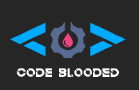

<h1 align="center"> C I A O </h1>

I am Udith Shyamsukha, a 2nd year under-grad from IT branch of VIT,Vellore. I have been coding since 2015 but I have lately gained interest in Open Source. Looking for some eventful collabs🤩...
<h2>📚 Làñgüâgēs & Frámêwørks</h2>

  
  
  
  
  
  
  
  
  
  
  
  
  
  
  
  
  
  
  

<h2>:wink: For the records...</h2>

  
  
  

<h2>🏆 A pinch of recent achievements...</h2>

  <ul>
    <li>First author of <a href="https://drive.google.com/file/d/1gtCTh_fuoQMp1N1R4lRGStxfoiMmk1Jy/view?usp=sharing">research paper</a> at IEEE Conference.</li>
    <li>Winner of Skillwars-Coding Competition'21 organized Skillship VIT.</li>
    <li><a href="https://devpost.com/software/eventour">Winner</a> of Hack-this-Fall Hackathon'21.</li>
    <li>Top Contributor of Student Portal-SWOC'22</li>
  </ul>

<h2>🏹 Projects </h2>

  
  
  

<h2>📌 Open Source Contribution</h2>

  

  

<h2>🎯 Hack-a-thons</h2>

  
  

 

<h2> Let's be Friends...</h2>

<!--
**udith51/udith51** is a ✨ _special_ ✨ repository because its `README.md` (this file) appears on your GitHub profile.

Here are some ideas to get you started:

- 🔭 I’m currently working on ...
- 🌱 I’m currently learning ...
- 👯 I’m looking to collaborate on ...
- 🤔 I’m looking for help with ...
- 💬 Ask me about ...
- 📫 How to reach me: ...
- 😄 Pronouns: ...
- ⚡ Fun fact: ...
-->
